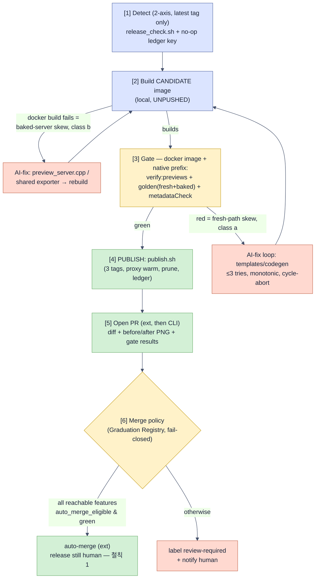

# dali-ui → extension/CLI code-sync automation

> **한 줄 요약:** 런타임 이미지는 매일 자동 재빌드되지만, dali-ui가 API를 바꾸면 확장/CLI의 **C++ 코드젠(하니스 템플릿·`buildRunner` 슬롯·`preview_server.cpp`)도 깨져** 모든 프리뷰가 컴파일 단계에서 실패한다. 이걸 자동으로 감지·수정하는 장치가 지금 하나도 없다. 해결책은 **기존 `dali-preview-runtime-release` agent-hub 에이전트를 "gate-before-publish" 형태로 진화**시키는 것: 후보 이미지를 만들어 → 컴파일 스윕 + 골든 렌더 게이트를 돌리고 → red면 헤드리스 AI가 코드젠을 수정(가드레일 안에서)해 green이 될 때까지 반복 → 그제서야 이미지를 GHCR에 push하고 코드 PR을 연다. **자율 머지는 기능 단위 "졸업제"** — 그 기능의 조용한 파손을 결정론적으로 잡는 *positive-semantic* 체크가 무인 CI에서 green일 때만 auto-merge, 그 외엔 사람 리뷰. 두 개의 철칙: `auto-merge ≠ auto-release`, `green ≠ correct`.

| | 결정 |
|---|---|
| 자율성 모델 | **졸업제 자율화(graduated autonomy)** — 기능별 게이트 충족 시에만 auto-merge |
| 커버 범위 | 확장 + CLI, **확장 우선**(버전 핀된 공유 라이브러리로 CLI가 뒤따름) |
| 실행 위치 | **단일 agent-hub 에이전트** (`dali-preview-runtime-release`가 진화) |
| 검증 게이트 | 컴파일 스윕(`verify:previews`) + 골든 렌더(fresh·baked 양 경로) + `metadataCheck` |
| 흐름 | **gate-before-publish** — 코드가 green이어야 이미지가 릴리즈됨 |
| AI 권한 | C++ 코드젠 편집 허용, **화이트리스트 + 검증 게이트로 감쌈** |
| 방향 | **Direction B** — 하드닝·통합 먼저, 그다음 자율화 |

---

## Problem

The docker runtime image already auto-rebuilds daily via the out-of-repo agent-hub agent `dali-preview-runtime-release` (2-axis detect → build → smoke → push 3 tags `dali_X.Y.Z-<sha>` / `dali_X.Y.Z` / `latest` → ledger). That automation deliberately watches **only `docker/`** — what compiles *into* the image — and never touches `src/*.ts` or the C++ codegen templates.

**"Code sync" is the missing half.** When dali-ui renames or removes an API, the g++ **compile paths** — the harness/plugin templates and the TypeScript slot-fillers that emit dali-ui C++ — skew and break *all* previews, even against a freshly rebuilt image. Nothing today regenerates or fixes that source automatically. Detection is purely reactive (`errorParser.detectRuntimeApiSkew` appends a hint when a human renders and the compile fails, for ~5 hard-coded member names) or human-triggered (manual `verify:previews`, local pre-push golden e2e). **No automation fires on a dali-ui release.**

### Cadence (why this matters)

Of the last **4 adopted** dali-ui bumps, **all 4 forced source edits** — roughly one API-driven code change every ~2.5 weeks across the Apr–Jul 2026 window. dali-ui tags weekly, but the repo pins one `DALI_UI_REF` (`docker/Dockerfile.runtime:98`) and adopts deliberately (~1 in 3). **Rule of thumb: an adopted bump ≈ a code change, not just `docker pull`.**

Historical breaks (all self-caught; zero end-user reports):

| # | Date | dali-ui | What broke | Touch point | Skew class |
|---|---|---|---|---|---|
| 1 | 2026-04-28 | pre-2.5.24 | fluent setter/type rename | samples | compile |
| 2 | 2026-06-04 | 2.5.19+ | `signal.h` member `Connect` | `preview_server.cpp` + templates | **build (baked)** |
| 3 | 2026-06-23 | 2.5.26 | fluent removal + `Children→AddChildren` + void setters | buildRunner, cppParser, templates, 60 samples | compile |
| 4 | 2026-07-07 | 2.5.28 | `UiConfig::SetAlwaysShowFocus` removed | harness template + `buildRunner` | compile |
| 5 | 2026-07-07 | 2.5.28 | actor coordinate-convention change | `preview_server.cpp` (baked) + harness | **silent semantic** |
| 6 | 2026-07-07 | adaptor 2.5.29 | `Window::GetSize`→`GetPositionSize` | `preview_server.cpp` (baked) | **build (baked)** |

### Two skew classes (the design must handle both)

- **(a) Fresh-compile-path skew** — the harness template / `buildRunner` slots emit a now-invalid symbol; the **image still builds** but every per-preview compile fails. (events 1,3,4)
- **(b) Baked-server-path skew** — `docker/preview_server.cpp` itself uses the removed/renamed API, so **`docker build` fails** and no image can be published. Currently worked around by hand-maintained `sed` patches in the release agent's `build_publish.sh`. (events 2,5,6)

A "release image, then run sync against it" ordering **cannot handle class (b)** — there is no image to run sync against. This is the decisive constraint on the flow (see Design → Flow).

### Test-coverage reality (audited — why full autonomy is not safe today)

The only **unattended** gate is cloud CI, which runs TypeScript compile + unit tests only — it never C++-compiles or renders a preview (`.github/workflows/ci.yml:20-25`; the CLI's render e2e job is commented out at `dali-ui-preview-cli/.github/workflows/ci.yml:47-48`). Every render gate lives in the **local pre-push hook** (opt-in `core.hooksPath`, skippable via `--no-verify`/`SKIP_E2E=1`, docker + `test/samples/` only) or is **manual**. Concretely:

- **Image-vs-placeholder is unverified in the extension.** The broken-image sample is `@render-only` (no pixel check); the golden CI does not even stage image assets. This is the historically-reported "이미지 preview 안 뜸" case, uncaught by any automatic gate. (CLI has a real check — red≥1000 / gray≥1000 in `render-modes.sh` — but it is manual-only.)
- **click-to-code correctness is coarse.** `metadataCheck.checkMetadataOnScreen` (`test/e2e/metadataCheck.ts:54-62`) flags **only** negative / off-left-top coordinates; a wrong-but-on-screen drift passes. CLI has **zero** on-screen assertion.
- **Focus ring** is only ever verified by hand / commit message; the pixel golden sits at ≈1% ≈ the `diffPercent<0.01` budget.
- **Pixel-diff is flaky** across a runtime-image rebuild (font/GPU/AA drift), so raw pixel goldens would false-positive and block a legitimate bump.

**Conclusion:** unattended auto-merge is currently safe **only** for render-independent logic regressions. This is what forces Direction B (harden the gates before automating) and the graduated-autonomy model.

## Goals

- On a new (adopted, latest) dali-ui tag, **automatically detect** whether the extension/CLI code skews, and **automatically produce a verified fix** for the skew classes the test suite can root-verify.
- The image and the code that matches it are **always co-verified and co-released** — eliminate the window where GHCR has a new image but the repo code is stale (the "51/51 previews fail" window).
- **Graduated autonomy:** a preview feature graduates to unattended auto-merge only when a *positive-semantic* check that fails on its silent break runs in an unattended gate. Everything else stays AI-drafted-PR + human merge.
- **Single agent-hub agent** so the whole run (detect → build → gate → fix → publish → PR) is one durable, monitorable run.
- Reuse the existing release agent's proven machinery (`release_check.sh`, `build_publish.sh`, `publish.sh`, `warm_proxy.py`, ledger, dependency-snapshot pinning, GHCR prune).
- Absorb the out-of-band `sed` patches into tracked, reviewed source.

### Non-goals

- **`auto-merge ≠ auto-release`.** The user-facing release (extension `.vsix` tag; CLI `main` push) stays human-gated until the fixture harness has caught ≥1 real skew in shadow mode. Auto-merge lands code on a branch/`main`-of-extension under the graduation policy; cutting the consumer release is a separate human action initially.
- Not re-architecting the parser / JSON fast path (it is insulated from renames by design and must stay so).
- Not covering non-adopted intermediate dali-ui tags — the gate/fix targets the **latest** accumulated tag only (see Assumptions).
- Not replacing the human review for features that have not graduated.

## Design

### Core principles

- **철칙 1 — `auto-merge ≠ auto-release`.** Verified code may auto-merge; shipping to users is a separate, initially-human step.
- **철칙 2 — `green ≠ correct`.** A check that passes on *absence of error* (e.g. `metadataCheck` only catching off-screen coords) does not qualify a feature for auto-merge. Only a **positive-semantic assertion** (the feature demonstrably rendered correctly) qualifies.

### The Graduation Registry (central artifact)

A machine-readable table, one row per preview feature, checked into the extension repo. The merge policy reads it. It is on the AI-fix **deny-list** (the AI may never edit it).

| column | meaning |
|---|---|
| `feature` | render-at-all, image, click-to-code, focus, theme, animation, layout, CJK, RTL, multifile |
| `code_regions` | source paths/globs this feature is reachable through (drives static "touched" computation) |
| `root_verify_check` | the check that fails deterministically on this feature's silent break |
| `unattended` | does that check run in an unattended gate (agent-hub required status)? |
| `positive_semantic` | does it assert correctness, not just absence-of-error? (철칙 2) |
| `auto_merge_eligible` | derived: `unattended && positive_semantic`. **All CLI rows are `false` until Phase 1 covers CLI.** |

### Flow — gate-before-publish (single agent)

The release agent **grows into** the sync agent. Its build/publish scripts are reused; the only structural changes are: (1) split `build_publish.sh` into *build* and *push*; (2) insert the gate + AI-fix loop between them; (3) condition `publish.sh` on a green gate; (4) add a PR/merge step after publish. No second agent; no inter-agent request.

**Why publish is gated (not "release then sync"):** class-(b) baked-server skew makes `docker build` fail, so there is no image to sync against; and gating publish guarantees the immutable tag `dali_X.Y.Z-<extSha>` always encodes the **fixed** ext sha, so no skew window ever exists.

**Loop cost:** a class-(a) fresh-path fix (harness template / codegen) does **not** require a full image rebuild — the gate recompiles the fresh harness against the existing candidate image, so the loop is `fix → re-gate`. Only a class-(b) fix (baked `preview_server.cpp` or the shared exporter baked into the image) triggers a candidate rebuild. In the diagram, `F2 → [2]` is drawn for uniformity but is a re-gate, not a rebuild, unless the fix touched baked/shared-baked source.

### Phase 1 — Harden (make each feature's silent break visible to an unattended gate)

No automation is built until these are green. Both repos.

- Promote `verify:previews` (native + docker modes) to a **required status check** → catches all rename/removed-member breaks (classes a and the compile part of b) broadly.
- Add an **extension image-vs-placeholder pixel assertion** (port the CLI's red≥1000 / gray≥1000; un-`@render-only` an image sample; make the golden runner stage assets).
- Strengthen **click-to-code**: add an **expected-rect (±tol) correctness** check for a known actor (not just sign-of-coordinate); add an on-screen assertion to the CLI.
- Add a **focus child-count 0→1** semantic assertion.
- Convert text/CJK-heavy goldens from raw pixel-diff to **semantic checks** (node-count, region-color); **auto-regenerate** pixel goldens on image rebuild to kill flakiness.
- **Encode the 6 historical breaks as fixtures** (the automation's regression harness; also used to validate the detector/fixer in Phase 3).
- **Where render gates run:** on the agent-hub runner (hosted CI cannot render complex DALi), surfaced back as a required status check. **Both runtime modes are required gates** — the primary maintainer uses native/local mode, and native-only skew (e.g. event #6, `Window` API) is *masked in docker* by the release agent's `sed` patch, so docker alone is insufficient:
  - **docker mode** — runs against the freshly-built candidate image (free; the runner just built it): `goldenTestRunner` + `metadataCheck` + `verify:previews:docker`.
  - **native mode** — runs `verify:previews` (native) + `serverGoldenRunner` against a **native dali-ui prefix built on the runner from the same dali-ui tag**, pinned to the same dependency snapshot as the image. The prefix is **cached keyed by the dali-ui tag** to amortize the build across runs.
  - After Phase 2 migrates the `sed` rules into tracked source, the native gate is also what **proves that migration** — docker no longer masks class-(b) skew, so native and docker must agree.

### Phase 2 — Consolidate (shrink the fix surface) as a versioned shared library

- Extract the pure slot-filling codegen out of the vscode-coupled `src/buildRunner.ts` into an **importable module** so the e2e runners and the CLI consume it → kills `test/e2e/standaloneBuildRunner.ts` drift.
- Make the baked `docker/preview_server.cpp` and the fresh `server/preview_harness.cpp.template` **share the metadata-exporter + scene-builder** via a common header/source so an API fix lands **once**.
- **CLI consumes a shared library with a stable interface, pinned by version** — *not* a whole-file copy. The CLI's deliberate divergences (rich semantic tree schema, devel-api `CalculateCurrentScreenExtents`, no focus/theme slots) are supplied **through** that interface. The drift check compares only the shared lib's **content hash**, preserving intended divergence.
- Prevent consolidation from re-opening a **baked↔fresh skew** (delta B2): version-stamp the shared source and add a **runtime handshake** — the fresh harness refuses to run if the image's baked exporter version ≠ its own. The golden gate must exercise **both** the fresh path and the baked JSON fast-path (`test:e2e:server` / `test:e2e:multifile`).
- Version the **plugin ABI** (`dali_preview_abi_version` across the `extern "C"` dlsym boundary); the server refuses a mismatched plugin → a hard gate for the otherwise-silent ABI-drift class.
- **Migrate the `build_publish.sh` `sed` rules into the tracked shared source** and delete the out-of-band patch step (delta S6).

### Phase 3 — Automate (the pipeline above), guardrailed

- **AI-fix runtime = headless `claude -p`:** the fix step invokes Claude Code in **print / non-interactive mode** (`claude -p "<prompt>"`) on the runner — there is no human at a terminal. The guardrails therefore map onto `claude -p` flags, enforced at the CLI (not just by prompt): the edit allowlist → `--allowedTools` / `--disallowedTools` (with the CI diff-scope reject as a hard backstop); machine-readable result for the pipeline → `--output-format json` (parse `is_error` / result / cost); non-interactive permissions → `--permission-mode` (never a prompt that would hang the run); the ≤3-attempt budget → a bounded number of invocations with the failing-gate output fed back in each round. The **PAT is never passed into the `claude -p` invocation** — the git-push step runs as a separate, non-LLM step (token isolation, delta B3).
- **Candidate-image loop:** the fix loop iterates against a **local, unpushed** candidate image (delta B1). "Image under test" is a distinct ledger state from "immutable pushed image".
- **AI-fix edit scope — hard allowlist (delta B6):** the AI may edit **only** the consolidated codegen module, the templates, and the `errorParser` skew regex. `test/**`, `*.golden.png`, `metadataCheck.ts`, and the Graduation Registry are **deny-listed**; CI rejects any PR whose diff touches them. Golden regeneration is a separate deterministic step, never an AI edit.
- **Hallucination gate (delta S2):** constrain the AI's context to the **new image's actual dali-ui headers** (`pkg-config --cflags` + umbrella header); grep-gate every dali-ui symbol in the diff against those headers.
- **Termination (delta S1):** ≤3 attempts, require **monotonic decrease** in failing-check count, abort on cycle-detected diffs; budget exhaustion → `review-required` (never a partial merge).
- **Non-determinism (delta S3):** require **2 independent clean-container verify passes that agree** + a **semantic-diff of the exported scene tree** (before/after) matching the intended feature. Pixel-green alone is insufficient.
- **Merge policy — fail-closed static reachability (delta B7):** "touched features" is computed from the Registry's `code_regions` (conservative over-approximation), **not** from red→green transitions. If any statically-reachable feature lacks a green *unattended, positive-semantic* check → **human review**.

### Credentials & security (single-agent-safe)

- **Fine-grained PAT** (maintainer-supplied), scoped to the two repos with minimal permissions (contents + pull_requests write), provisioned as a **runner secret** (never on disk in plaintext, never committed). It is longer-lived than a GitHub App installation token, so the mitigations are: minimal scope, periodic rotation, and the token-isolation below. (A GitHub App would be tighter but is not available/required in this environment.) Actions appear under the token owner's identity.
- **Token isolation:** the AI-fix step (which ingests g++ output + release notes) and the git-push step run as **separate steps of the same agent**; the token is **never in the LLM's context**. This contains the prompt-injection → auto-release vector without splitting the process (delta B3/B4). This isolation matters *more* with a PAT than with a short-lived App token.
- **CLI safety (delta B4):** CLI releases via github-clone to `main` (no PR gate). Therefore every CLI Registry row is `auto_merge_eligible=false` until Phase 1 covers CLI; until then the AI opens a PR to a `next` branch and a human promotes. **Auto-merge never auto-releases.**

### Idempotency, triggering & the "latest tag" assumption

- Extends the existing ledger / no-op key (`dali_X.Y.Z-<extSha>`) with a **code-sync-verified** state. Daily interval retained; the **expensive LLM path runs only when the gate is red** (the no-op key short-circuits everything else).
- The release agent is (in another session) being modified to release **only the latest** among accumulated dali-ui tags. The gate/fix therefore targets the **latest tag only**, matching the deliberate adoption cadence. Consequence: a single run may face **multiple API deltas at once** (skipped intermediate tags), so the AI-fix loop must handle a batch of simultaneous breaks — validated by the multi-break historical fixtures.

## Testing the automation itself

Replay the **6 historical break events** (table above) as fixtures: feed the pipeline the old dali-ui tag known to break, and assert (Phase 1) the gate goes red on the right feature(s), and (Phase 3) the AI-fixer reaches green within budget and the resulting diff stays inside the allowlist. This doubles as the regression harness that must catch ≥1 real skew in **shadow mode** before `auto-release` is ever enabled.

## Milestones

| Milestone | Deliverable | Value even if we stop here |
|---|---|---|
| **M0 (in progress, other session)** | release agent releases latest tag per dali-ui tag | image auto-published |
| **M1** | Harden extension gates + 6 historical fixtures | first-ever **unattended real-render** verification |
| **M2** | Harden CLI gates (currently none) | CLI reaches parity for detection |
| **M3** | Consolidate codegen into versioned shared lib + handshake + ABI version + migrate `sed` | one fix surface; `standaloneBuildRunner` drift gone |
| **M4** | Insert gate + candidate-build into the agent (publish gated), **shadow mode** (detect only); provision native-prefix build + cache and the PAT secret on the runner | skew detected automatically on release, both modes |
| **M5** | AI-fix + PR (always `review-required`) | verified fix drafted for a human in minutes |
| **M6** | Graduated auto-merge (eligible features first); `sed` hack retired | hands-off for graduated features |

## Assumptions & open questions

- `lwc0917` owns both repos (auto-merge is impossible fork→upstream). The auto-cut extension release (post-M6) must run the `.vscodeignore` / unzip check or it ships the 46 MB CLI-bloated `.vsix` (delta M1).
- The agent-hub runner has egress to `api.github.com` + git push (an install prerequisite distinct from the BART GHCR proxy route).
- **Credential (decided):** a maintainer-supplied **fine-grained PAT** scoped to the two repos is provisioned as a runner secret for branch push / PR / merge. (Not a GitHub App — see Credentials & security.)
- **Native gate (decided):** the runner can build a native dali-ui prefix from source (toolchain present) so the **native-mode gate runs alongside docker-mode**; the prefix is cached per dali-ui tag. Provisioned at M4.

## Verified touch points (where a dali-ui API change forces edits)

| Touch point | Baked into image? | ext / CLI / both |
|---|---|---|
| `docker/preview_server.cpp` | **yes (rebuild)** | ext |
| `server/preview_harness.cpp.template` | no (fresh) | ext |
| `server/preview_plugin.cpp.template` (ABI) | no (loaded by baked server) | ext |
| `src/buildRunner.ts` slot-fillers | no | ext |
| `test/e2e/standaloneBuildRunner.ts` (duplicate) | no | ext (drifts) |
| `src/cppParser.ts` / `src/sliceBuilder.ts` (vocab) | no | both (copied) |
| `src/errorParser.ts` skew regex | no | ext (CLI dropped it) |
| `dali-ui-preview-cli/server/preview_harness.cpp.template` | no | **CLI (separate repo, diverged)** |
